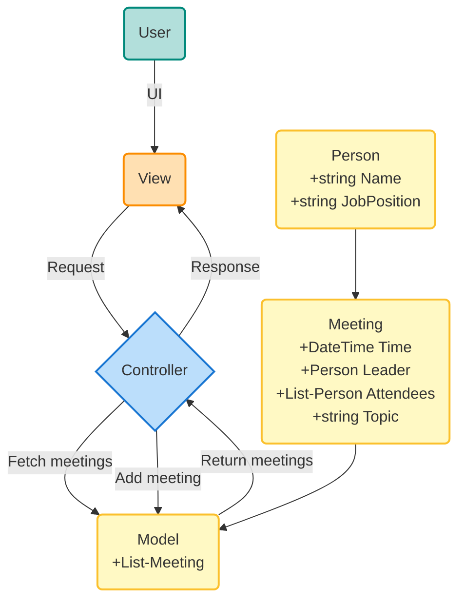

```mermaid
flowchart TD
%% Nodes
A("User"):::green
B("View"):::orange
C{"Controller"}:::blue
D("Model <br> +List-Meeting"):::yellow
E("Meeting <br> +DateTime Time <br> +Person Leader" <br> +List-Person Attendees <br> +string Topic):::yellow
F("Person <br> +string Name <br> +string JobPosition"):::yellow

%% Edges
A -- UI --> B
B -- Request --> C
C -- Response --> B
C -- Fetch meetings --> D
C -- Add meeting --> D
D -- Return meetings --> C
E --> D
F --> E

%% Styling
classDef green fill:#B2DFDB,stroke:#00897B,stroke-width:2px;
classDef orange fill:#FFE0B2,stroke:#FB8C00,stroke-width:2px;
classDef blue fill:#BBDEFB,stroke:#1976D2,stroke-width:2px;
classDef yellow fill:#FFF9C4,stroke:#FBC02D,stroke-width:2px;
```
